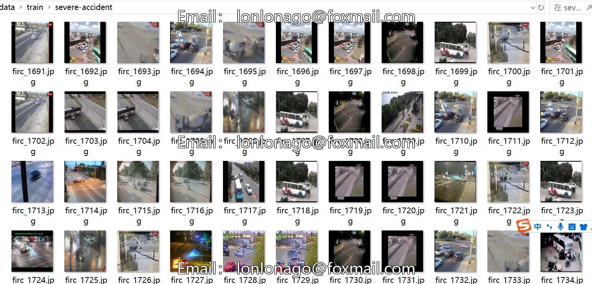
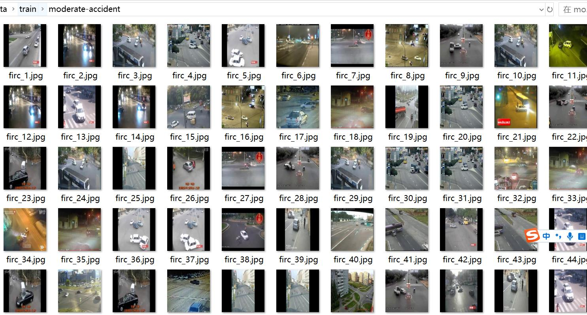
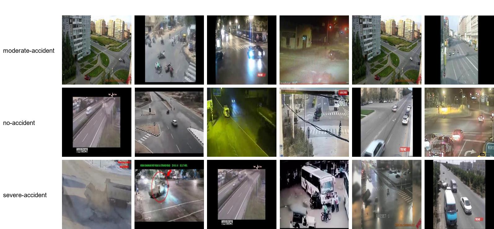

# Traffic Accident Image Classification Dataset: 3550 Images in 3 Categories

**Dataset Type**: For image classification use only, not suitable for target detection with unlabeled files.

**Dataset Format**: Only contains JPG images, each category folder contains corresponding images.

**Number of Images (JPG Files)**: 3550

**Number of Categories**: 3

- Moderate-accident
- No-accident
- Severe-accident

**Category Names**: ['Moderate-accident', 'No-accident', 'Severe-accident']

**Image Count per Category**:

- Moderate-accident training set image count: 813
- No-accident training set image count: 877
- Severe-accident training set image count: 794

- Moderate-accident validation set image count: 224
- No-accident validation set image count: 236
- Severe-accident validation set image count: 252

- Moderate-accident test set image count: 103
- No-accident test set image count: 129
- Severe-accident test set image count: 122

**Total Images**:

- Moderate-accident total image count: 1140
- No-accident total image count: 1242
- Severe-accident total image count: 1168

**Important Notes**: There is no specific note provided.

**Special Declaration**: This dataset does not guarantee the accuracy of the trained model or weight file.

**Image Preview**: 

## Images

Here is a pay link on Stripe ( https://buy.stripe.com/3cs8yP7sY87d0vu9AB ). Please contact me lonlonago@foxmail.com after funding $89, and I will send you a complete data files , thank you!

